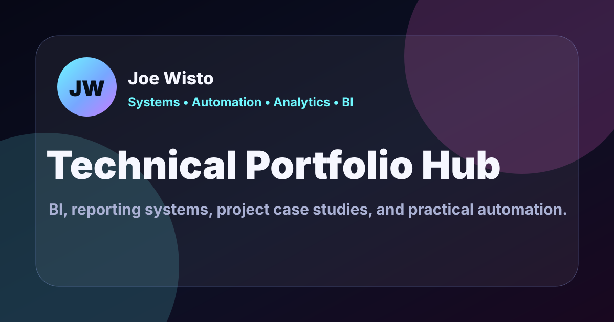

# Joe Wisto — Systems • Automation • Analytics • BI

<p align="center">
  
</p>

<p align="center">
  <strong>I build clean systems, robust automation, and meaningful insights.</strong>
</p>

<p align="center">
  <a href="https://wistoworks.com/">Live Portfolio</a>
  ·
  <a href="https://wistoworks.com/projects/">Projects</a>
  ·
  <a href="https://www.linkedin.com/in/joey-wisto">LinkedIn</a>
  ·
  <a href="mailto:connect@wistoworks.com">Contact</a>
</p>

---

## About this repository

This repository powers my technical portfolio: a collection of analytics, automation, business intelligence, operational systems, and interactive experiments built around practical problems.

My professional background spans 7+ years in reporting, analytics, automation, and operations. At IntouchCX, I led reporting and analytics across 27 client programs and helped move reporting toward BigQuery-backed and automated workflows that reduced manual reporting effort by roughly 40%.

The work here extends that experience through hands-on systems and portfolio projects: building metric layers, modeling operational workflows, validating data, designing useful interfaces, automating repeatable processes, and making technical assumptions visible rather than hiding them behind a polished output.

The portfolio itself is also part of the project. It is a static multi-page application with structured project metadata, schema-backed data contracts, deterministic validation, automated testing, build-output checks, and Cloudflare Pages deployment.

**Explore the finished experience at [wistoworks.com](https://wistoworks.com/).**

---

## Selected work

### [Procurement KPI Analysis](https://wistoworks.com/projects/procurement-kpi-analysis.html)

**BI · ETL · KPI design · Data QA**

An interactive supplier-performance case study built around a validated metric layer for savings, delivery reliability, defects, and compliance.

Rather than treating a supplier score as a universal grade, the project exposes the underlying measures, quality rules, and business weights so stakeholders can see how priorities change the result.

`SQL` · `BigQuery` · `Python` · `pandas` · `Looker Studio` · `Data QA`

---

### [Where Revenue Gets Stuck](https://wistoworks.com/projects/quote-to-cash-workflow-audit.html)

**Process analytics · Systems thinking · Data integrity**

A deterministic fictional Quote-to-Cash audit that follows separate CRM, billing, and revenue-recognition entities through the lifecycle.

It keeps duplicate keys, broken handoffs, stalled records, missing stages, and timing exceptions visible before calculating conversion and stage metrics—because incomplete workflows are part of the analysis, not noise to be silently cleaned away.

`Python` · `pandas` · `JavaScript` · `Synthetic data` · `Process analytics`

---

### [Multi-Platform Publishing System](https://wistoworks.com/projects/multi-platform-publishing-system.html)

**Systems · Automation · Content operations**

A sanitized portfolio adaptation of a contract/independent publishing workflow designed for a nontechnical content owner.

The system connects familiar Google tools with a lightweight static frontend so structured content can drive journal entries, photos, mapped locations, and related experiences without requiring a traditional CMS or ongoing source-code editing.

`JavaScript` · `Google Sheets` · `Google Forms` · `Google Drive` · `Apps Script` · `Cloudflare Pages`

---

### [PHX Transit Pulse](https://wistoworks.com/projects/phx-transit-pulse.html)

**Operational UX · Data contracts · Interactive visualization**

A responsive transit-operations dashboard built with deterministic fictional replay data and a real Phoenix-area basemap.

The project explores vehicle movement, service alerts, operational states, filtering, map and non-map inspection, and accessible replay controls while being explicit about where the simulation ends and real transit data begins.

`GTFS-inspired data` · `Static JSON` · `JavaScript` · `SVG` · `MapLibre` · `Data contracts`

---

### [Gravity Fleet Lab](https://wistoworks.com/games/gravity-fleet-lab.html)

**Telemetry · Interactive data visualization · State modeling**

A playable orbital strategy experiment where the interaction itself generates the dataset.

Fleet movement, conquest, wormholes, AI pressure, and match outcomes become structured telemetry that feeds scoring, heatmaps, benchmarks, and post-match analytical views.

`HTML Canvas` · `JavaScript` · `Telemetry` · `Data visualization` · `localStorage`

---

### [Shrinkflation Tracker](https://wistoworks.com/projects/shrinkflation-tracker.html)

**Consumer analytics · Data normalization · Information design**

A consumer-facing analytics prototype that compares package size, shelf price, and price per unit to reveal price increases that ordinary shelf labels can obscure.

The implementation deliberately separates curated demonstration history from source-aware product observations so demo data is not presented as live retail history.

`HTML` · `CSS` · `JavaScript` · `JSON` · `Data modeling` · `Data visualization`

---

### [The Real Cost of Public Charging](https://wistoworks.com/projects/ev-true-cost.html)

**Scenario modeling · Consumer analytics · Data provenance**

An interactive cost-per-mile comparison built around a confirmed EV charging receipt, a gasoline benchmark, and editable assumptions.

Instead of claiming one universal answer, the model shows how the result changes between public fast charging, mostly-home charging, and home-only charging while keeping confirmed, benchmark, owner-provided, and mock inputs distinguishable.

`JavaScript` · `JSON` · `Scenario modeling` · `Data visualization`

---

**[Explore the full project showcase →](https://wistoworks.com/projects/)**

---

## How I approach the work

The projects vary, but the same principles show up repeatedly.

**Start with the decision, not the dashboard.**
I try to understand what someone needs to know or do before deciding what data, interface, or automation should exist.

**Make definitions visible.**
Metrics are only useful when their populations, rules, exceptions, and assumptions are understandable.

**Treat data quality as part of the product.**
Invalid dates, broken joins, missing stages, duplicate records, unavailable feeds, and uncertain inputs should be handled intentionally rather than disappearing during cleanup.

**Automate repeatable work without making it mysterious.**
A maintainable workflow should make the system easier to operate and reason about—not merely replace a manual process with an opaque one.

**Be explicit about provenance.**
Projects in this repository distinguish real, anonymized, synthetic, fictional, curated, benchmark, and mock data where those differences matter.

**Build for the person using the result.**
Accessibility, responsive behavior, fallback states, plain-English explanations, and inspectable details are treated as part of the technical solution.

---

## Technical foundation

The portfolio intentionally stays close to the web platform while using supporting tooling where it creates real value.

### Frontend

* Static multi-page HTML
* CSS
* Vanilla JavaScript
* HTML Canvas and SVG where appropriate
* JSON-backed project and application data
* Responsive and print-specific presentation

### Analytics and automation

* Python
* pandas
* SQL / BigQuery
* Google Sheets and Apps Script
* Deterministic fixture and artifact generation
* Data validation and audit workflows

### Repository engineering

* JSON Schema contracts
* Project lifecycle and route validation
* Automated Python and JavaScript tests
* Static-route smoke testing
* Build-output allowlist / denylist validation
* GitHub Actions CI
* Cloudflare Pages deployment

The browser-facing application remains intentionally static. Data preparation, validation, analysis, and operational tooling live outside the deployed frontend where appropriate.

---

## Validation philosophy

A portfolio project should not get a free pass just because it is a demo.

This repository includes validation around areas such as:

* project registry lifecycle and public-route consistency;
* JSON contract compliance;
* generated Procurement and Quote-to-Cash artifacts;
* transit fixtures and map behavior;
* Gravity Fleet behavior and telemetry;
* Showcase configuration;
* static build output;
* route availability;
* obvious secrets and local-path leakage;
* contact-function behavior.

The main repository gate is:

```bash
npm run check
```

That orchestrates formatting, linting, validation, tests, the production build, distribution validation, and static-output smoke checks.

---

## Run locally

### Requirements

* Node.js 24
* npm 11
* Python 3.12
* [uv](https://docs.astral.sh/uv/)

### Install

```bash
npm ci
uv sync --dev --locked
```

### Validate

```bash
npm run check
```

### Preview source directly

```bash
python -m http.server 8000
```

Then open:

```text
http://localhost:8000
```

### Build the production artifact

```bash
npm run build
npm run validate:dist
npm run test:dist
```

The generated `dist/` directory is the deployment boundary used by Cloudflare Pages.

---

## Repository guide

```text
.
├── index.html            # Portfolio / professional snapshot
├── projects/             # Analytics, systems, and case-study experiences
├── games/                # Interactive telemetry experiments
├── data/                 # Browser data, fixtures, and generated artifacts
├── schemas/              # JSON Schema contracts
├── sql/                  # Maintained SQL assets
├── tools/                # Build, validation, analytics, and operational tooling
├── tests/                # Python and JavaScript test coverage
├── docs/                 # Architecture, decisions, methods, QA, and project docs
├── functions/            # Server-side Cloudflare functionality
├── AGENTS.md             # Repository guidance for development agents
└── PORTFOLIO_ROADMAP.md  # Implementation-status source of truth
```

For deeper implementation detail:

* [`PORTFOLIO_ROADMAP.md`](./PORTFOLIO_ROADMAP.md) — current implementation status and planned work
* [`docs/architecture/`](./docs/architecture/) — architecture and deployment baselines
* [`docs/decisions/`](./docs/decisions/) — architecture decision records
* [`tools/README.md`](./tools/README.md) — repository tooling and specialized workflows
* [`docs/procurement/`](./docs/procurement/) — Procurement data contract and metric definitions
* [`docs/qtc/`](./docs/qtc/) — Quote-to-Cash methodology and data contract
* [`docs/phx-transit/`](./docs/phx-transit/) — PHX Transit architecture, data contracts, validation, and design work

---

## Data and project boundaries

Not every project in the repository is intended for public presentation.

Public portfolio discovery is controlled through lifecycle metadata in `data/projects.json`. Projects must be both `ready` and `public` before they are treated as publishable portfolio work.

Some source files, experiments, fixtures, and in-progress projects remain in the repository for continued development even when they are intentionally absent from the public showcase.

Likewise, portfolio projects demonstrate applied capability but should not automatically be interpreted as employer or client work. Where a project uses fictional, synthetic, sanitized, anonymized, or mock inputs, the public experience and supporting documentation are designed to say so.

---

## Deployment

The portfolio is deployed through **Cloudflare Pages** from the production build generated by this repository.

**Live site:** https://wistoworks.com/

The repository maintains an explicit build/deployment boundary: source files are transformed into a reviewed `dist/` artifact, that artifact is validated, and generated deployment output is not manually patched.

---

## Connect

If the work here overlaps with a problem you're trying to solve—or you just want to talk systems, analytics, automation, or BI—I'd be glad to connect.

**Portfolio:** [wistoworks.com](https://wistoworks.com/)
**LinkedIn:** [linkedin.com/in/joey-wisto](https://www.linkedin.com/in/joey-wisto)
**Email:** [connect@wistoworks.com](mailto:connect@wistoworks.com)
